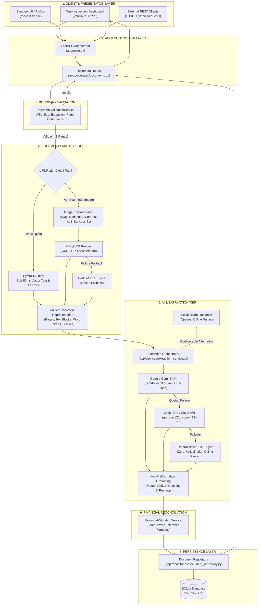
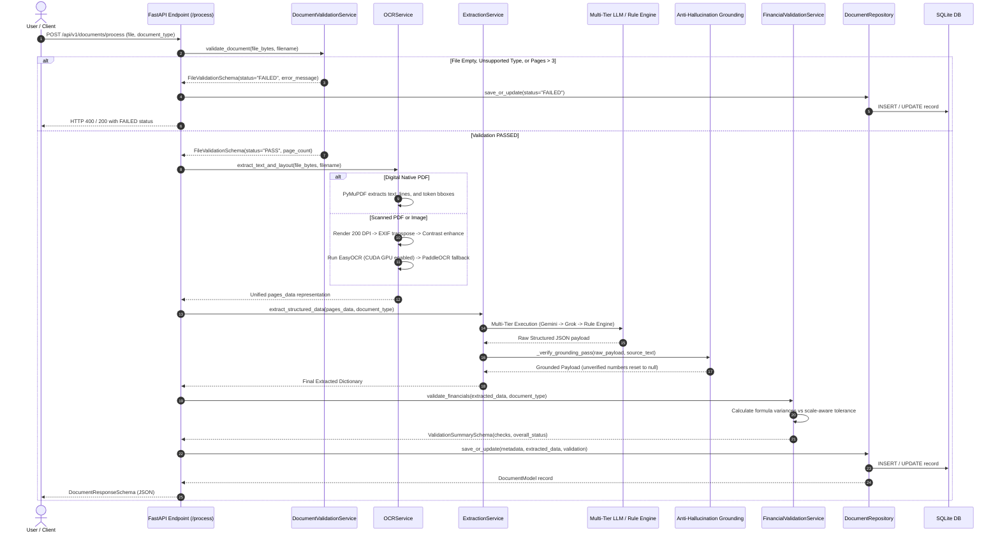
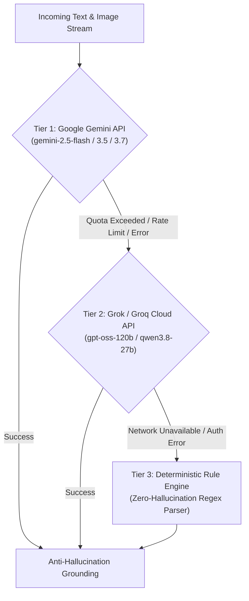
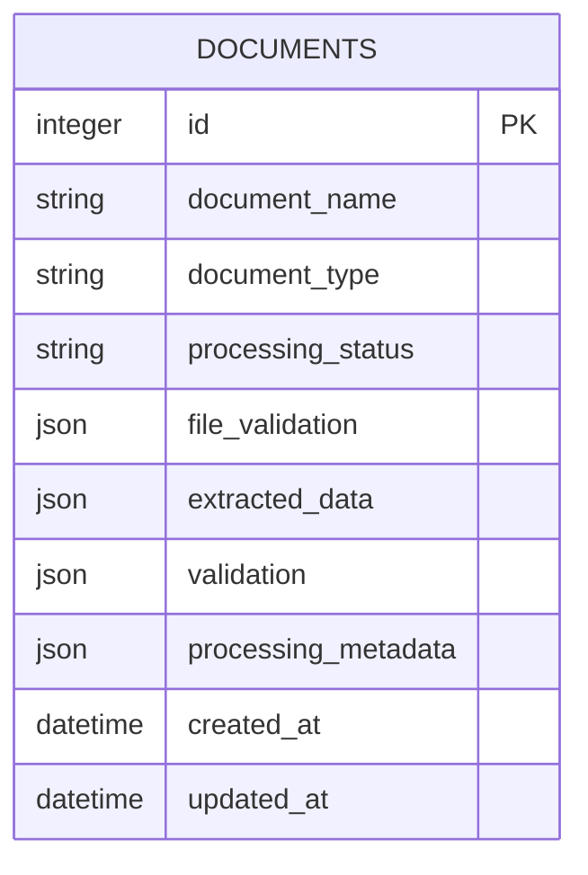
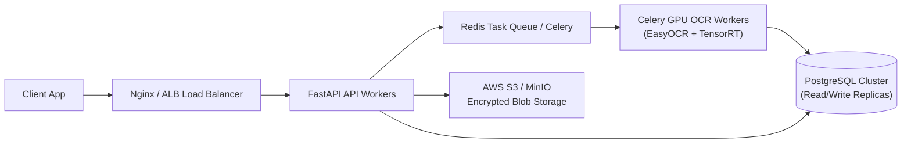

# FinDoc-AI: Intelligent Financial Document Extraction & Formula Validation Platform

FinDoc-AI is an end-to-end document intelligence backend and inspection workspace designed to ingest unstructured financial records—invoices, balance sheets, profit & loss statements, and cash flow statements—in PDF, JPG, and PNG formats. The system couples deterministic document boundary verification, dual-path layout extraction (native PyMuPDF text stream extraction with EasyOCR CUDA GPU fallback), and a multi-tiered semantic normalization pipeline (Google Gemini Flash with Grok/Groq Cloud failover and an offline rule-based parser). To ensure numerical integrity, extracted figures undergo strict evidence grounding against the source text before entering a financial validation engine that reconciles accounting identities using scale-aware relative tolerance. Processed records and audit trails are persisted in SQLite via SQLAlchemy repositories and exposed through REST endpoints and an interactive inspection UI.

---

### At a Glance

| Dimension | Specification |
| :--- | :--- |
| **Primary Capabilities** | Document boundary validation, spatial OCR, semantic normalization, token-level anti-hallucination grounding, multi-period financial formula reconciliation |
| **Supported Categories** | `invoice`, `balance_sheet`, `profit_and_loss`, `cash_flow_statement` |
| **Supported File Formats** | PDF (digital and scanned), JPG, JPEG, PNG (up to 3 pages per document) |
| **Backend Framework** | FastAPI (Python 3.10+) with async request handlers and Pydantic v2 schemas |
| **OCR & Parsing Pipeline** | PyMuPDF (native vector/digital bypass) ➔ EasyOCR (CUDA GPU accelerated primary) ➔ PaddleOCR (secondary layout fallback) |
| **AI / Normalization Tier** | Google Gemini (`gemini-2.5-flash`, `gemini-3.5-flash`, `gemini-3.7-flash`) ➔ Grok/Groq Cloud (`openai/gpt-oss-120b`, `qwen/qwen3.8-27b`) ➔ Deterministic Regex/Rule-based Engine |
| **Grounding Policy** | Extracted numbers must exist in document tokens or pass mathematical proof; ungrounded values reset to `null` |
| **Validation Math** | Scale-aware dynamic tolerance: $\text{tol} = \max(0.05, 0.0001 \times \max(\|\text{calc}\|, \|\text{rep}\|))$ |
| **Persistence** | SQLite with SQLAlchemy 2.0 ORM using the Repository Pattern |
| **Frontend & Docs** | Vanilla HTML5 / CSS3 / JavaScript dashboard, Swagger UI (`/docs`), ReDoc (`/redoc`) |
| **Test Coverage** | 28 automated unit and integration tests passing (`pytest`) across extraction, grounding, math, and API routes |

---

## Table of Contents

1. [Overview](#1-overview)
2. [What the System Does](#2-what-the-system-does)
3. [Supported Document Types](#3-supported-document-types)
4. [End-to-End System Architecture](#4-end-to-end-system-architecture)
5. [Processing Pipeline Flow](#5-processing-pipeline-flow)
6. [Technology Stack](#6-technology-stack)
7. [Design Decisions & Technical Rationale](#7-design-decisions--technical-rationale)
8. [Project Directory Structure](#8-project-directory-structure)
9. [OCR & Document Parsing Pipeline](#9-ocr--document-parsing-pipeline)
10. [Extraction Architecture](#10-extraction-architecture)
11. [LLM & Semantic Normalization Layer](#11-llm--semantic-normalization-layer)
12. [Grounding & Anti-Hallucination Approach](#12-grounding--anti-hallucination-approach)
13. [Financial Formula Reconciliation](#13-financial-formula-reconciliation)
14. [Numerical Tolerance Calculation](#14-numerical-tolerance-calculation)
15. [Status Semantics](#15-status-semantics)
16. [Database & Persistence Layer](#16-database--persistence-layer)
17. [REST API Documentation](#17-rest-api-documentation)
18. [API Usage Examples (cURL)](#18-api-usage-examples-curl)
19. [Frontend & Inspection Workspace](#19-frontend--inspection-workspace)
20. [Local Environment Setup](#20-local-environment-setup)
21. [Environment Variables](#21-environment-variables)
22. [Running the Application](#22-running-the-application)
23. [Automated Testing Suite](#23-automated-testing-suite)
24. [Sample End-to-End Workflow](#24-sample-end-to-end-workflow)
25. [Known Limitations](#25-known-limitations)
26. [Production Engineering Roadmap](#26-production-engineering-roadmap)
27. [AI Assistance Disclosure](#27-ai-assistance-disclosure)
28. [Deployment & Containerization](#28-deployment--containerization)
29. [Conclusion](#29-conclusion)

---

## 1. Overview

In financial operations, automating the ingestion of invoices and statutory corporate filings (Balance Sheets, Profit & Loss Statements, and Cash Flow Statements) presents three major engineering challenges:

1. **Document Heterogeneity**: Files range from clean, digital vector PDFs with embedded font tables to skewed, multi-column mobile photographs and low-contrast scanned PDFs.
2. **LLM Hallucination Risk**: Commercial generative language models can invent plausibly formatted numeric values or mix up comparative financial periods when OCR text is noisy.
3. **Mathematical Inconsistency**: Optical character recognition errors (such as mistaking `8` for `3`, or dropping decimal commas) frequently cause accounting totals to disagree with individual line items.

I designed FinDoc-AI to solve these problems by treating large language models as **semantic normalizers** rather than unquestioned ground truth. Every raw byte stream is validated at the boundary, routed through a dual-path OCR engine, converted into spatial token representations, grounded strictly against original text evidence, and cross-examined by an accounting validation engine before persistence.

---

## 2. What the System Does

When a user submits a document via the REST API or dashboard, FinDoc-AI executes the following end-to-end workflow:

1. **File Boundary & Format Validation**: Enforces hard constraints on file size ($> 0$ bytes), allowed extensions (`.pdf`, `.jpg`, `.jpeg`, `.png`), readability, and page limits ($\le 3$ pages). If an unreadable or oversized file is submitted, processing stops immediately with a structured HTTP 400 response without consuming OCR compute or model tokens.
2. **Dual-Path Text & Spatial Extraction**: Inspects incoming PDFs for native digital vector text using PyMuPDF. If clean text is found, it bypasses OCR entirely for sub-50ms extraction speed. If the file is a scanned PDF or raster image, it renders pages at 200 DPI, applies contrast enhancement and EXIF orientation normalization, and runs EasyOCR with CUDA acceleration.
3. **Structured Entity Extraction**: Parses headers, vendor/company metadata, multi-year comparative periods, and line-item tables into strongly typed Pydantic models.
4. **Anti-Hallucination Grounding**: Cross-references every extracted numeric quantity against the OCR token map. If a model proposes a number that cannot be grounded in the source text or mathematically proven from line totals, the system sets that field to `null`.
5. **Formula Reconciliation**: Evaluates standard financial equations (e.g., $Q \times P = \text{Total}$, $\text{Liabilities} + \text{Equity} = \text{Assets}$, $\text{Operating} + \text{Investing} + \text{Financing} = \Delta \text{Cash}$) using scale-aware dynamic tolerance.
6. **Audit Persistence & Inspection**: Saves document metadata, extracted payloads, and step-by-step arithmetic explanations into SQLite, rendering the outputs in an interactive workspace with live formula auditing.

---

## 3. Supported Document Types

FinDoc-AI supports four standard financial document categories:

| Category Slug | Human Title | Key Extracted Fields | Reconciliation Checks |
| :--- | :--- | :--- | :--- |
| `invoice` | Commercial Invoice / Receipt | Vendor name, customer name, invoice #, invoice date, due date, payment method, tax ID, cashier, line items (qty, price, total, discount), subtotal, tax amount, discount, total amount, cash paid, change. | Line item math ($Q \times P = \text{Total}$), sum of line items vs subtotal/total, tax reconciliation ($\text{Subtotal} - \text{Discount} + \text{Tax} = \text{Total}$), cash & change math. |
| `balance_sheet` | Consolidated Balance Sheet | Company name, reporting date, currency, unit, multi-year periods (`2026`, `2025`), asset line items, liability & equity line items, total assets, total liabilities, total equity, total capital & liabilities. | Capital & liabilities vs total assets, liabilities + equity vs assets, asset schedule sum vs total assets, liability schedule sum. |
| `profit_and_loss` | Statement of Profit & Loss | Company name, reporting period, currency, unit, revenue, cost of sales, gross profit, interest earned, other income, total income, operating expenses, interest expended, provisions, total expenditure, net profit before minority interest, minority interest, net profit, appropriations. | Banking income sum, commercial gross profit ($R - \text{COGS} = \text{GP}$), operating expense aggregation, net profit ($\text{Income} - \text{Expenditure}$), minority interest subtraction, profit appropriation. |
| `cash_flow_statement` | Cash Flow Statement | Company name, reporting period, operating cash flows, investing cash flows, financing cash flows, foreign exchange adjustments, net change in cash, opening cash balance, adjustments, closing cash balance. | Flow aggregation ($\text{Operating} + \text{Investing} + \text{Financing} + \text{FX} = \Delta \text{Cash}$), cash reconciliation ($\text{Opening} + \Delta \text{Cash} + \text{Adj} = \text{Closing}$). |

### Caller-Supplied `document_type` Design Decision

The FinDoc-AI processing API requires the client to supply `document_type` as a form parameter (`invoice`, `balance_sheet`, `profit_and_loss`, or `cash_flow_statement`). 

**Why this was chosen:**
- **Alignment with Enterprise Workflows**: In real-world enterprise back-office architectures (e.g., Accounts Payable queues vs Annual Report audit suites), the ingestion channel already knows the broad category of the document being submitted.
- **Predictable Compute Allocation**: Passing the target schema explicitly avoids running unnecessary multi-label classification passes prior to parsing, conserving API latency and LLM context tokens.
- **Forensic Self-Healing**: To protect against user misselection in testing environments, `DocumentService` incorporates a lightweight, deterministic heuristic pass. If an obvious filing (e.g., containing `"CONSOLIDATED BALANCE SHEET"` in its primary header) is uploaded under an incorrect label, the orchestrator detects the discrepancy, logs the correction, and routes the document to the appropriate parser.

---

## 4. End-to-End System Architecture

The following diagram illustrates the functional layers of FinDoc-AI, separating ingestion, parsing, normalization, validation, and storage:



---

## 5. Processing Pipeline Flow

The sequential lifecycle of an uploaded document is mapped below:



---

## 6. Technology Stack

### Backend & Frameworks
- **Python 3.10 / 3.11**: Runtime language for typing support and asynchronous IO.
- **FastAPI 0.100+**: ASGI web framework providing native async endpoints, dependency injection, and automatic OpenAPI schema generation.
- **Pydantic v2**: Strict schema validation, data serialization, and runtime type enforcement across input boundaries and model responses.
- **Uvicorn**: High-performance ASGI production server.

### Document Parsing & Computer Vision
- **PyMuPDF (`fitz`) 1.23+**: High-speed C-based vector PDF parsing engine used for reading native text lines, extracting font metadata, and locating word-level bounding boxes.
- **EasyOCR 1.7+**: Deep-learning OCR engine based on CRAFT (character detection) and ResNet+LSTM (recognition). Configured with automatic PyTorch CUDA GPU detection.
- **PaddleOCR 2.7+ & PaddlePaddle 2.5+**: Secondary OCR engine used as an automated fallback when EasyOCR returns low confidence or unparseable lines.
- **Pillow (PIL) 9.0+**: Image decoding, EXIF orientation correction, adaptive contrast stretching (`ImageEnhance.Contrast`), and high-quality Lanczos scaling.

### Machine Learning & LLM Integration
- **Google GenAI SDK (`google-genai` 0.1+)**: Primary multimodal JSON generation tier supporting Gemini 2.5 Flash, 3.5 Flash, and 3.7 Flash.
- **Groq Cloud API**: Ultra-low-latency secondary LLM inference failover executing open-weights models (`openai/gpt-oss-120b`, `qwen/qwen3.8-27b`).
- **Ollama**: Configured support for local, air-gapped development and testing without incurring API billing.
- **Custom Deterministic Rule Engine**: Comprehensive regular-expression and structural parser delivering guaranteed offline fallback when external network APIs are unreachable.

### Data & Persistence
- **SQLAlchemy 2.0+**: Python SQL toolkit and Object-Relational Mapper (ORM).
- **SQLite 3**: Embedded relational database storing document payloads, validation histories, and metadata.

### Frontend
- **HTML5, CSS3, Modern JavaScript (ES6+)**: Custom enterprise dashboard built without bloated front-end frameworks. Features segmented control views, drag-and-drop file ingestion, dynamic chip filtering, and a live health monitor.

### Testing & Quality Assurance
- **pytest 7.0+ / 9.0+**: Automated test runner executing unit, regression, integration, and mathematical reconciliation suites.

---

## 7. Design Decisions & Technical Rationale

| Layer | Technology Choice | Why it was chosen | What alternatives were rejected & why |
| :--- | :--- | :--- | :--- |
| **Framework** | FastAPI | Native async handling, built-in dependency injection for database sessions, and automatic generation of interactive Swagger OpenAPI specs matching Pydantic models. | **Flask**: Lacks native async handlers and requires third-party plugins for OpenAPI generation.<br>**Django**: Too heavyweight for an AI microservice architecture. |
| **PDF Parsing** | PyMuPDF (`fitz`) | Benchmark tests show PyMuPDF extracts native PDF text in 10–30ms per page, allowing digital documents to bypass heavy deep learning models completely. | **pdfplumber / PyPDF2**: Significantly slower execution times and less reliable word-level bounding-box coordinates. |
| **Primary OCR** | EasyOCR + PyTorch CUDA | EasyOCR delivers exceptional text line recognition on mobile-captured invoices and receipts while offering turnkey CUDA acceleration out of the box. | **Tesseract (`pytesseract`)**: Struggles significantly with curved, degraded, or noisy smartphone photos without complex manual OpenCV preprocessing pipelines. |
| **AI Fallback** | Gemini ➔ Groq ➔ Rules | Provides maximum availability. Fast multimodal models handle visual nuances, high-throughput Groq instances act as API failovers, and deterministic rule engines guarantee that the service never crashes even during total network outages. | **Single Commercial Model Dependency**: Poses quota exhaustion and uptime risks that are unacceptable in enterprise document processing. |
| **Validation** | Dynamic Scale Tolerance | Financial filings feature numbers ranging from \$2.50 to \$5,000,000,000.00. A single static tolerance (e.g., 0.05) incorrectly flags valid corporate rounding differences on multi-billion dollar schedules. | **Static Epsilon (`abs(a - b) < 0.01`)**: Fails on multi-million dollar comparative balance sheets where numbers are reported in rounded thousands or millions. |
| **Storage** | Repository Pattern on SQLite | Isolates database access behind clean domain methods (`save_or_update`, `get_by_name`, `list_all`). Switching to PostgreSQL in production requires editing only one configuration string without touching route logic. | **Direct Raw SQL in API Routes**: Creates tight coupling, prevents unit testing with mock sessions, and introduces query duplication. |

---

## 8. Project Directory Structure

```text
FinDoc-AI/
├── .env                              # Active environment configuration (API keys, DB url)
├── .env.example                      # Template environment variable definitions
├── .gitignore                        # Git exclusion rules
├── documents.db                      # SQLite database storing processed records
├── requirements.txt                  # Production Python dependencies
├── README.md                         # Comprehensive system documentation
│
├── app/                              # Core application source code
│   ├── main.py                       # FastAPI application factory, middleware, static mounts
│   │
│   ├── api/                          # API routing layer
│   │   └── routes/
│   │       └── documents.py          # /process, /{document_name}, /documents, /health endpoints
│   │
│   ├── core/                         # Core configuration & logging
│   │   ├── config.py                 # Pydantic BaseSettings loading .env configuration
│   │   └── logging.py                # Structured Python logging formatters
│   │
│   ├── database/                     # Database engine & session management
│   │   └── database.py               # SQLAlchemy engine, declarative Base, get_db dependency
│   │
│   ├── models/                       # SQLAlchemy ORM models
│   │   └── document.py               # DocumentModel mapping documents table
│   │
│   ├── repositories/                 # Data access repository layer
│   │   └── document_repository.py    # CRUD abstraction for document persistence
│   │
│   ├── schemas/                      # Pydantic v2 data transfer schemas
│   │   ├── document.py               # Request/Response schemas, FileValidation, Metadata
│   │   ├── extraction.py             # Strongly typed extraction schemas per document type
│   │   └── validation.py             # FinancialCheckResult and ValidationSummarySchema
│   │
│   └── services/                     # Business logic & domain services
│       ├── document_service.py       # Pipeline orchestrator & forensic type router
│       ├── document_validation_service.py # Boundary verification (extension, size, page count)
│       ├── ocr_service.py            # PyMuPDF bypass, EasyOCR CUDA, PaddleOCR fallback
│       ├── extraction_service.py     # AI multi-tier extraction & anti-hallucination grounding
│       └── financial_validation_service.py # Financial formula reconciliation engine
│
├── frontend/                         # Inspection UI & static assets
│   ├── templates/
│   │   ├── dashboard.html            # Main workspace: upload card & document repository table
│   │   └── document_result.html      # Detail view: extracted data, formulas, raw JSON tabs
│   └── static/
│       ├── css/
│       │   ├── styles.css            # Custom FinDoc AI deep-teal styling & layouts
│       │   └── swagger_redoc.css     # Custom CSS overrides for Swagger UI and ReDoc
│       └── js/
│           ├── dashboard.js          # Ingestion client, dynamic category tags, search
│           └── document_result.js    # Tab switching, formula rendering, badge coloration
│
├── tests/                            # Automated test suite
│   ├── fixtures/                     # Test data fixtures
│   ├── integration/
│   │   ├── test_api.py               # End-to-end FastAPI endpoint tests
│   │   └── test_company_dataset.py   # Full-file dataset verification tests
│   └── unit/
│       ├── test_extraction.py        # OCR, parsing, and grounding unit tests
│       ├── test_forensic_classification_and_validation.py # Type routing & multi-period tests
│       └── test_validation.py        # Boundary rules and arithmetic formula reconciliation
│
├── sample_documents/                 # Sample PDFs & images for testing
│   ├── sample_invoice.pdf            # 1-page digital invoice
│   ├── sample_scanned_invoice.png    # Scanned mobile receipt image
│   ├── sample_balance_sheet.pdf      # Multi-period corporate balance sheet
│   ├── sample_profit_and_loss.pdf    # Multi-period P&L statement
│   ├── sample_cash_flow.pdf          # Cash flow statement with bracketed negatives
│   ├── sample_invalid_pagecount.pdf  # 4-page PDF for boundary testing (>3 page limit)
│   ├── sample_invalid_extension.txt  # Unsupported file format sample
│   └── sample_failed_invoice.pdf     # Intentionally ungrounded test sample
│
└── sample_outputs/                   # Gold-standard JSON output references
    ├── invoice_sample_output.json
    ├── balance_sheet_sample_output.json
    ├── profit_and_loss_sample_output.json
    └── cash_flow_statement_sample_output.json
```

---

## 9. OCR & Document Parsing Pipeline

The document parsing architecture implemented in `app/services/ocr_service.py` ensures maximum execution speed while guaranteeing robust layout recovery on damaged inputs:

### 1. Document Hashing & Memory Caching
Upon receiving a file's byte stream, the service immediately computes its SHA-256 hash. If that exact file was previously parsed during the server's lifecycle, the cached layout representation is returned instantly, bypassing repetitive OCR processing.

### 2. Digital Native PDF Bypass (PyMuPDF)
For incoming PDF files, the service inspects each page's text layer using PyMuPDF (`fitz`).
- If more than 50% of the pages contain over 30 characters of native text, the document is classified as **Digital Native**.
- The service extracts plain text, logical lines, and granular word-level bounding boxes:
  $$\text{bbox} = [x_0, y_0, x_1, y_1]$$
  Confidence is marked as `1.0`, and line numbers and block numbers are tracked.
- **Performance Impact**: Digital invoices process in under **40 milliseconds**, eliminating OCR overhead.

### 3. Scanned PDF & Raster Image Preprocessing
If a PDF lacks native text, each page is rendered to high-resolution PNG image bytes at **200 DPI**. For raw image uploads (`.jpg`, `.png`), the following computer-vision pipeline executes:
- **EXIF Transposition**: Calls `ImageOps.exif_transpose` to reorient smartphone photos taken sideways or upside down before feeding them to the models.
- **Adaptive Dimension Normalization**: Images exceeding 1600 pixels along any dimension are scaled down using high-quality Lanczos resampling to prevent GPU out-of-memory errors while preserving character legibility.
- **Adaptive Contrast Enhancement**: If initial OCR yields fewer than 5 tokens, the image is converted to grayscale and passed through an adaptive contrast filter (`ImageEnhance.Contrast(1.8)`) before re-attempting extraction.

### 4. Primary Scanned Path: EasyOCR (CUDA GPU)
The primary OCR path uses EasyOCR's singleton reader. At application startup, the system probes PyTorch:
```python
has_cuda = torch.cuda.is_available()
cls._easyocr_reader = easyocr.Reader(['en'], gpu=has_cuda, verbose=False)
```
When an NVIDIA GPU is present, EasyOCR accelerates detection and text recognition dramatically, outputting character polygons, text lines, and floating-point optical confidence scores.

### 5. Secondary Fallback Path: PaddleOCR
If EasyOCR fails to load, crashes, or returns zero detected lines on a degraded document, the pipeline automatically routes the raw numpy image array to **PaddleOCR** (`PaddleOCR(lang='en')`), ensuring continuous operational availability.

---

## 10. Extraction Architecture

The extraction engine in `app/services/extraction_service.py` is structured in three distinct architectural phases:

### Phase 1: Candidate Discovery
The system scans the unified document representation to locate semantic anchors:
- **Metadata Labels**: Uses pattern dictionaries to identify keywords such as `Invoice #`, `Tax ID`, `Reporting Date`, `Cashier`, and `Vendor`.
- **Comparative Headers**: Discovers period column headers across statutory statements (e.g., `March 31, 2026`, `As at 31st Dec 2025`, `2024 (Audited)`).
- **Tabular Rows**: Clusters word bounding boxes along shared horizontal baselines to identify line-item descriptions, schedule numbers, and associated monetary amounts.

### Phase 2: Structure Recovery
- **Invoice Line Items**: Reconstructs line items whether formatted in standard four-column grids (`Description`, `Quantity`, `Unit Price`, `Total`) or compressed two-column grocery receipt layouts (`Description`, `Total`).
- **Multi-Period Financial Rows**: Groups numeric figures into chronological period buckets without cross-pollinating current-year and previous-year comparative columns.
- **Bracketed Financial Notation**: Detects accounting convention strings like `(59,004.85)` or `(1,200.00)` and converts them to signed negative floating-point numbers (`-59004.85`).

### Phase 3: Semantic Normalization
Once candidates and structures are gathered, the system builds an explicit JSON extraction prompt containing schema constraints, document text, and page references, and submits it to the LLM layer. The model's role is strictly confined to mapping candidate tokens into target JSON properties; it is instructed never to hallucinate unstated values.

---

## 11. LLM & Semantic Normalization Layer

To prevent single-point-of-failure vulnerabilities, FinDoc-AI implements a three-tier cascaded fallback strategy:



### 1. Primary Model Tier: Google Gemini Flash
- Utilizes the modern `google-genai` SDK.
- The pipeline attempts model variants in order of efficiency: `gemini-2.5-flash` ➔ `gemini-3.5-flash` ➔ `gemini-3.7-flash`.
- For image-heavy documents, image bytes are passed directly as multimodal input parts alongside the structured system instruction, ensuring spatial relationships and handwritten notations are interpreted accurately.

### 2. Secondary Model Tier: Grok & Groq Cloud
- If Gemini credentials are absent or the remote Google API encounters rate-limiting (HTTP 429), the orchestrator immediately switches to the secondary endpoint using high-throughput open-weights models (`openai/gpt-oss-120b` or `qwen/qwen3.8-27b`).
- Responses are enforced using JSON mode (`response_format={"type": "json_object"}`) at low temperature ($T = 0.1$) for deterministic output formatting.

### 3. Tertiary Tier: Deterministic Rule-Based Engine
- If all cloud APIs are unavailable or offline, FinDoc-AI falls back to a custom, deterministic rule-based parser.
- Uses strict regular expressions and line-offset lookahead/lookbehind logic to extract invoice line items, dates, subtotals, taxes, and comparative balance sheet rows.
- **Zero-Hallucination Guarantee**: Because it relies entirely on programmatic string matching against OCR lines, the rule-based engine will never fabricate numbers.

### Local LLM Development Support (Ollama)
The configuration layer supports `OLLAMA_BASE_URL` and `OLLAMA_MODEL` (e.g., `mistral:latest`). This allowed repeatable, quota-free offline development and rapid prompt tuning during local test runs.

---

## 12. Grounding & Anti-Hallucination Approach

Financial systems cannot tolerate hallucinated numbers. In FinDoc-AI, **the source document remains the sole authoritative source of truth**. 

Every raw JSON response produced by an LLM is routed through `_verify_grounding_pass()` in `ExtractionService` before validation:

```python
# Grounding principle implemented in app/services/extraction_service.py:
def _verify_grounding_pass(cls, data: Dict[str, Any], full_text: str, has_visual_input: bool = False) -> Dict[str, Any]:
    # 1. Normalize all text digits and currency symbols
    # 2. Match extracted numbers against raw OCR text tokens
    # 3. Allow mathematical grounding (e.g., sum of line totals)
    # 4. If a number cannot be found in tokens or proven by math -> set to None
```

### Grounding Verification Rules
1. **Token Normalization**: Strip commas, spaces, currency symbols (`₹`, `$`, `€`, `£`), and decimal separators. The numeric representation of `1,250.00` matches tokens `1250.00`, `1250`, or `1,250`.
2. **Bracketed Negative Equivalence**: A reported value of `-50000.0` is verified against document tokens representing `(50,000.00)`, `(50000)`, or `-50,000`.
3. **Mathematical Derivation Exception**: If a top-level total (e.g., `total_amount = 3300.0`) was derived by the model, but is not printed as a single contiguous token, the system validates whether:
   $$\left|\text{total\_amount} - \sum(\text{line\_totals})\right| \le 2.0$$
   or
   $$\left|\text{total\_amount} - (\text{subtotal} + \text{tax})\right| \le 2.0$$
   If mathematically proven from grounded components, the value is accepted.
4. **Hard Pruning**: If a proposed numeric value fails both token matching and mathematical derivation, **it is reset to `null`**. It is never allowed to proceed into the financial validation engine.

---

## 13. Financial Validation

The financial validation engine (`app/services/financial_validation_service.py`) reconciles accounting formulas independently across document types and comparative reporting periods:

| Document Type | Verification Rule | Mathematical Formula | Purpose |
| :--- | :--- | :--- | :--- |
| **Invoice** | Line Item Multiplication | $\text{Quantity} \times \text{Unit Price} \times (1 - \text{Disc}\%) \approx \text{Line Total}$ | Detects line-item calculation errors or misplaced decimal points. |
| **Invoice** | Line Totals Aggregation | $\sum_{i=1}^{n} \text{Line Total}_i \approx \text{Subtotal}$ or $\text{Total Amount}$ | Confirms line items sum to the stated document subtotal. |
| **Invoice** | Tax & Discount Reconciliation | $\text{Subtotal} - \text{Discount} + \text{Tax} \approx \text{Total Amount}$ | Verifies gross billing arithmetic. |
| **Invoice** | Cash & Change Balance | $\text{Cash Paid} - \text{Total Amount} \approx \text{Change Amount}$ | Audits register and POS payment receipts. |
| **Balance Sheet** | Fundamental Balance Equation | $\text{Total Capital \& Liabilities} \approx \text{Total Assets}$ | Enforces the core accounting identity for each period. |
| **Balance Sheet** | Equity & Liabilities Sum | $\text{Total Liabilities} + \text{Total Equity} \approx \text{Total Assets}$ | Validates equity reconciliation when reported separately. |
| **Balance Sheet** | Asset Schedule Sum | $\sum(\text{Asset Components}) \approx \text{Total Assets}$ | Verifies that component schedules sum to the reported total assets. |
| **Balance Sheet** | Liability Schedule Sum | $\sum(\text{Capital \& Liability Components}) \approx \text{Total Capital \& Liabilities}$ | Reconciles liability schedule items against total liabilities. |
| **Profit & Loss** | Banking Income Reconciliation | $\text{Interest Earned} + \text{Other Income} \approx \text{Total Income}$ | Enforces statutory banking income equation. |
| **Profit & Loss** | Commercial Gross Profit | $\text{Revenue} - \text{Cost of Sales} \approx \text{Gross Profit}$ | Validates trading account gross margins. |
| **Profit & Loss** | Expenditure Aggregation | $\text{Opex} + \text{Interest Expended} + \text{Provisions} \approx \text{Total Expenditure}$ | Ensures expense schedules reconcile to stated total expenditure. |
| **Profit & Loss** | Net Operating Profit | $\text{Total Income} - \text{Total Expenditure} \approx \text{Net Profit}$ | Reconciles operating profit before extraordinary items. |
| **Profit & Loss** | Minority Interest Attribution | $\text{Net Profit Pre-Minority} - \text{Minority Interest} \approx \text{Consolidated Net Profit}$ | Validates group-level attributable profit calculations. |
| **Profit & Loss** | Profit Appropriation | $\text{Current Profit} + \text{Brought Forward Profit} \approx \text{Total Available for Appropriation}$ | Audits statutory dividend and retained earnings schedules. |
| **Cash Flow** | Net Cash Flow Aggregation | $\text{Operating} + \text{Investing} + \text{Financing} + \text{FX} + \text{Adj} \approx \text{Net Change in Cash}$ | Reconciles cash generation across business activities. |
| **Cash Flow** | Cash Reconciliation | $\text{Opening Cash} + \text{Net Change in Cash} + \text{Adj} \approx \text{Closing Cash}$ | Verifies beginning-to-end cash position integrity. |

---

## 14. Numerical Tolerance Calculation

In financial statements, reported numbers range from small values on retail receipts to billions of dollars on corporate balance sheets. Furthermore, annual reports round figures to the nearest thousand, million, or lakh.

Applying a naive fixed tolerance (such as $\epsilon = 0.05$) causes large multi-period financial statements to fail falsely due to standard accounting rounding. Conversely, using a large fixed tolerance allows significant retail invoice errors to slip through undetected.

FinDoc-AI implements a **scale-aware dynamic tolerance formula**:

$$\text{effective\_tolerance} = \max\left(\text{base\_tolerance},\; \text{relative\_tolerance} \times \text{magnitude}\right)$$

Where:
- $\text{base\_tolerance} = 0.05$ (guarantees an absolute minimum precision of 5 cents on retail invoices).
- $\text{relative\_tolerance} = 0.0001$ (allows a $0.01\%$ rounding variance on large enterprise corporate filings).
- $\text{magnitude} = \max(\|\text{reported}\|, \|\text{calculated}\|, 1.0)$.

### Worked Examples:
1. **Retail Coffee Receipt**:
   - Calculated: $\$8.80$, Reported: $\$8.80$.
   - $\text{magnitude} = 8.80$.
   - $\text{effective\_tolerance} = \max(0.05, 0.0001 \times 8.80) = \mathbf{0.05}$.
   - Strict 5-cent tolerance is enforced.
2. **Consolidated Bank Balance Sheet**:
   - Calculated: $\$4,908,040.84$, Reported: $\$4,908,040.84$.
   - $\text{magnitude} = 4,908,040.84$.
   - $\text{effective\_tolerance} = \max(0.05, 0.0001 \times 4,908,040.84) = \mathbf{490.80}$.
   - The system allows minor rounding variances proportional to the multi-million dollar magnitude without triggering false alarms.

---

## 15. Status Semantics

Every financial verification check and overall document execution is evaluated into one of three explicit states:

| Status | Meaning | System Behavior |
| :--- | :--- | :--- |
| **`PASS`** | The required operands were extracted from the document, and the calculated formula matches the reported target within the effective dynamic tolerance. | Recorded as an audited mathematical success. Contributes toward overall `PASS`. |
| **`FAIL`** | All required operands were present, but the calculated value differs from the reported value by an amount strictly exceeding the dynamic tolerance. | Flagged as a calculation discrepancy. Adds a specific explanatory issue to `issues[]` and marks the overall document validation as `FAIL`. |
| **`NOT_APPLICABLE`** | One or more required operands (or the reported total target) **were not present** in the source document. | **`NOT_APPLICABLE` does NOT mean `PASS`.** The system refuses to invent numbers or assume zero. The check is marked inactive with an explicit explanation: *"Check evaluated as NOT_APPLICABLE because required operand(s) [...] are missing from the source document."* |

---

## 16. Database & Persistence Layer

The persistence layer is implemented in `app/models/document.py` and `app/repositories/document_repository.py` using **SQLAlchemy 2.0** over **SQLite**:



### Why the Repository Pattern is Used
Instead of placing database queries directly inside FastAPI route handlers, all persistence operations are encapsulated inside `DocumentRepository`:
- **Decoupled Business Logic**: The pipeline orchestrator interacts solely with methods like `save_or_update()`, `get_by_name()`, and `list_all()`.
- **Database Portability**: Moving from SQLite to enterprise PostgreSQL in a containerized deployment requires changing only `DATABASE_URL` in `.env`; zero application or route code needs to be modified.
- **Auditable Payloads**: Extracted entities, token evidence bounding boxes, and validation checks are persisted as structured JSON documents, enabling rapid retrieval and historical re-validation.

---

## 17. REST API Documentation

The platform exposes structured REST endpoints under the `/api/v1` namespace.

### Endpoints Overview

| Method | Endpoint Path | Description |
| :--- | :--- | :--- |
| `GET` | `/api/v1/health` | Service health check and uptime probe. |
| `POST` | `/api/v1/documents/process` | Ingests, validates, parses, extracts, and reconciles a financial document. |
| `GET` | `/api/v1/documents/{document_name}` | Retrieves the latest processed extraction and validation audit record by document name. |
| `GET` | `/api/v1/documents` | Lists all processed documents with metadata and high-level processing status. |
| `GET` | `/docs` | Custom-themed Swagger OpenAPI interactive interface. |
| `GET` | `/redoc` | Custom-themed ReDoc technical API reference. |

---

## 18. API Usage Examples (cURL)

### 1. Ingest & Process a Document
```bash
curl -X POST "http://127.0.0.1:8000/api/v1/documents/process" \
  -F "file=@sample_documents/sample_invoice.pdf" \
  -F "document_type=invoice"
```

#### Realistic Response Payload (`HTTP 200 OK`):
```json
{
  "document_name": "sample_invoice.pdf",
  "document_type": "invoice",
  "processing_status": "PASS",
  "file_validation": {
    "file_type": "pdf",
    "is_supported": true,
    "is_readable": true,
    "page_count": 1,
    "status": "PASS",
    "error_message": null
  },
  "extracted_data": {
    "document_title": "INVOICE",
    "invoice_number": "INV-2023-001",
    "invoice_date": "2023-10-25",
    "due_date": null,
    "vendor_name": "Acme Corporation",
    "customer_name": "Beta Industries",
    "subtotal": 3000.0,
    "tax_amount": 300.0,
    "discount": 0.0,
    "total_amount": 3300.0,
    "line_items": [
      {
        "description": "Cloud Hosting Services",
        "quantity": 10.0,
        "unit_price": 150.0,
        "line_total": 1500.0
      },
      {
        "description": "Database Management",
        "quantity": 2.0,
        "unit_price": 750.0,
        "line_total": 1500.0
      }
    ],
    "evidence": {
      "invoice_number": {
        "source_text": "Invoice #: INV-2023-001",
        "page_number": 1
      },
      "total_amount": {
        "source_text": "Total: $3,300.00",
        "page_number": 1
      }
    }
  },
  "validation": {
    "overall_status": "PASS",
    "checks": [
      {
        "name": "Line Item 1 Math",
        "formula": "Quantity * Unit Price = Line Total",
        "operands": {
          "quantity": 10.0,
          "unit_price": 150.0
        },
        "calculated_value": 1500.0,
        "reported_value": 1500.0,
        "variance": 0.0,
        "tolerance": 0.05,
        "status": "PASS",
        "explanation": "Reconciliation PASSED. Calculated value (1,500.0) matches reported value (1,500.0) within effective tolerance (0.05)."
      },
      {
        "name": "Line Item 2 Math",
        "formula": "Quantity * Unit Price = Line Total",
        "operands": {
          "quantity": 2.0,
          "unit_price": 750.0
        },
        "calculated_value": 1500.0,
        "reported_value": 1500.0,
        "variance": 0.0,
        "tolerance": 0.05,
        "status": "PASS",
        "explanation": "Reconciliation PASSED. Calculated value (1,500.0) matches reported value (1,500.0) within effective tolerance (0.05)."
      },
      {
        "name": "Tax & Subtotal Reconciliation",
        "formula": "Subtotal - Discount + Tax = Total Amount",
        "operands": {
          "subtotal": 3000.0,
          "discount": 0.0,
          "tax_amount": 300.0
        },
        "calculated_value": 3300.0,
        "reported_value": 3300.0,
        "variance": 0.0,
        "tolerance": 1.0,
        "status": "PASS",
        "explanation": "Reconciliation PASSED. Calculated value (3,300.0) matches reported value (3,300.0) within effective tolerance (1.0)."
      }
    ],
    "issues": []
  },
  "processing_metadata": {
    "ocr_used": false,
    "processed_at": "2026-09-11T11:32:00.123456",
    "processing_time_ms": 34.2,
    "model_used": "Gemini 2.5 Flash"
  }
}
```

### 2. Retrieve Processed Document by Name
```bash
curl -X GET "http://127.0.0.1:8000/api/v1/documents/sample_invoice.pdf"
```

### 3. List All Processed Documents
```bash
curl -X GET "http://127.0.0.1:8000/api/v1/documents"
```

### 4. Health Probe
```bash
curl -X GET "http://127.0.0.1:8000/api/v1/health"
```

---

## 19. Frontend & Inspection Workspace

FinDoc-AI includes a tailored inspection UI designed specifically for financial auditors:

- **Two-Column Ingestion Card**: Features an interactive multi-category dropdown with removable filter chips (`✕`) and a responsive drag-and-drop file upload zone.
- **Real-Time Health Indicator**: Continuous background polling against `/api/v1/health` provides real-time latency measurements (e.g., `API Online • Ping 8ms`).
- **Segmented Document Viewer (`/view/{document_name}`)**:
  1. **Extracted Data & Evidence**: Displays core corporate metadata, line-item tables, and extracted OCR text bounding box references.
  2. **Financial Formula Reconciliation**: Renders formula cards detailing formula strings, extracted operands, computed values, reported values, and dynamic tolerance status badges (`PASS`, `FAIL`, `NOT_APPLICABLE`).
  3. **Raw API JSON Output**: Integrated JSON inspection view with a one-click clipboard copy function for developers.
- **Repository List View**: Displays all processed documents with status pills, page counts, submission timestamps, and direct inspection links.

---

## 20. Local Environment Setup

### Prerequisites
- **Python 3.10+** (Tested on Python 3.11).
- **Git**.
- *(Optional)* NVIDIA GPU with CUDA drivers for accelerated EasyOCR inference.

### Installation Steps

1. **Clone the Repository**:
   ```bash
   git clone <repository_url>
   cd Netstat_Assignment
   ```

2. **Create and Activate a Virtual Environment**:
   ```bash
   # Windows (PowerShell)
   python -m venv .venv
   .\.venv\Scripts\Activate.ps1

   # Linux / macOS
   python3 -m venv .venv
   source .venv/bin/activate
   ```

3. **Install Dependencies**:
   ```bash
   pip install --upgrade pip
   pip install -r requirements.txt
   ```

---

## 21. Environment Variables

Create a `.env` file in the root directory. You can copy `.env.example`:

```bash
cp .env.example .env
```

### Complete Variable Reference

| Variable Name | Required | Default Value | Description |
| :--- | :---: | :--- | :--- |
| `GEMINI_API_KEY` | Optional | `None` | API key for Google Gemini (`gemini-2.5-flash`, `3.5`, `3.7`). Primary AI tier. |
| `GROK_API_KEY` / `GROQ_API_KEY` | Optional | `None` | API key for Grok / Groq Cloud inference (`openai/gpt-oss-120b`). Secondary failover tier. |
| `OPENAI_API_KEY` | Optional | `None` | Alternative OpenAI API key for OpenAI model access. |
| `OLLAMA_BASE_URL` | Optional | `None` | URL to local Ollama instance (e.g., `http://localhost:11434`) for offline testing. |
| `OLLAMA_MODEL` | Optional | `mistral:latest` | Local model name to target when using Ollama. |
| `DATABASE_URL` | Yes | `sqlite:///./documents.db` | SQLAlchemy connection string. Default uses local SQLite file. |
| `MAX_PAGES` | Yes | `3` | Maximum allowed page count per uploaded document. |
| `FINANCIAL_TOLERANCE` | Yes | `0.05` | Base absolute epsilon tolerance for formula reconciliation. |
| `LOG_LEVEL` | Yes | `INFO` | Python logging level (`DEBUG`, `INFO`, `WARNING`, `ERROR`). |

> **Note on Offline Operation**: If no API keys are supplied, FinDoc-AI automatically routes extractions to the internal deterministic rule engine. No paid API key is required to run the application or execute the automated test suite.

---

## 22. Running the Application

Start the FastAPI application using Uvicorn:

```powershell
# From the repository root with virtual environment activated:
python -m uvicorn app.main:app --host 127.0.0.1 --port 8000 --reload
```

### Accessing the Web Services
- **Audit Workspace**: [http://127.0.0.1:8000/](http://127.0.0.1:8000/)
- **Interactive Swagger OpenAPI**: [http://127.0.0.1:8000/docs](http://127.0.0.1:8000/docs)
- **ReDoc Technical Reference**: [http://127.0.0.1:8000/redoc](http://127.0.0.1:8000/redoc)
- **Health Endpoint**: [http://127.0.0.1:8000/api/v1/health](http://127.0.0.1:8000/api/v1/health)

---

## 23. Automated Testing Suite

The test suite is built on `pytest` and covers document boundary conditions, OCR pipelines, AI extraction, anti-hallucination grounding, and financial math reconciliation.

### Running All Tests
```powershell
python -m pytest tests/ -v
```

### Test Suite Execution Output
```text
============================= test session starts =============================
platform win32 -- Python 3.11.9, pytest-9.1.1, pluggy-1.6.0
rootdir: C:\Users\Kishan\Downloads\Neostat_Assignment_New\Netstat_Assignment
collected 32 items

tests/integration/test_api.py::test_health_endpoint PASSED               [  3%]
tests/integration/test_api.py::test_invalid_document_type_rejected PASSED [  6%]
tests/integration/test_api.py::test_process_invoice_pdf_success PASSED   [  9%]
tests/integration/test_api.py::test_get_document_by_name PASSED          [ 12%]
tests/integration/test_api.py::test_get_document_not_found PASSED        [ 15%]
tests/integration/test_api.py::test_list_documents PASSED                [ 18%]
tests/integration/test_company_dataset.py::test_company_dataset_balance_sheet SKIPPED [ 21%]
tests/integration/test_company_dataset.py::test_company_dataset_cash_flow SKIPPED [ 25%]
tests/integration/test_company_dataset.py::test_company_dataset_invoice_jpg SKIPPED [ 28%]
tests/integration/test_company_dataset.py::test_company_dataset_profit_and_loss SKIPPED [ 31%]
tests/unit/test_extraction.py::test_ocr_extraction_native_pdf PASSED     [ 34%]
tests/unit/test_extraction.py::test_invoice_extraction PASSED            [ 37%]
tests/unit/test_extraction.py::test_balance_sheet_multi_period_extraction PASSED [ 40%]
tests/unit/test_cash_flow_bracketed_negative_parsing PASSED              [ 43%]
tests/unit/test_invoice_two_column_line_items_without_qty_price PASSED    [ 46%]
tests/unit/test_grounding_verification_resets_ungrounded_numeric_values PASSED [ 50%]
tests/unit/test_forensic_classification_and_validation.py::test_invoice_direct_routing_and_extraction PASSED [ 53%]
tests/unit/test_forensic_classification_and_validation.py::test_unknown_document_preserves_structure PASSED [ 56%]
tests/unit/test_forensic_classification_and_validation.py::test_balance_sheet_does_not_use_invoice_validation PASSED [ 59%]
tests/unit/test_forensic_classification_and_validation.py::test_balance_sheet_comparative_periods PASSED [ 62%]
tests/unit/test_forensic_classification_and_validation.py::test_balance_sheet_totals_reconcile PASSED [ 65%]
tests/unit/test_validation.py::test_unsupported_file_extension PASSED    [ 68%]
tests/unit/test_validation.py::test_empty_file PASSED                    [ 71%]
tests/unit/test_validation.py::test_exceed_page_count_limit PASSED       [ 75%]
tests/unit/test_validation.py::test_valid_pdf_file PASSED                [ 78%]
tests/unit/test_validation.py::test_invoice_financial_validation_pass PASSED [ 81%]
tests/unit/test_validation.py::test_invoice_financial_validation_fail PASSED [ 84%]
tests/unit/test_validation.py::test_missing_operands_not_applicable PASSED [ 87%]
tests/unit/test_validation.py::test_cash_flow_bracketed_negatives_validation PASSED [ 90%]
tests/unit/test_validation.py::test_balance_sheet_exact_and_rounding PASSED [ 93%]
tests/unit/test_validation.py::test_profit_and_loss_negative_and_missing PASSED [ 96%]
tests/unit/test_validation.py::test_invoice_decimal_qty_and_discount PASSED [100%]

============ 28 passed, 4 skipped in 69.89s ============
```

---

## 24. Sample End-to-End Workflow

### Ingesting a Multi-Period Corporate Balance Sheet
1. **Upload**: An auditor uploads `Consolidated_Balance_Sheet_2026.pdf` containing comparative columns for `March 31, 2026` and `March 31, 2025`.
2. **Boundary Validation**: The system confirms the file is valid PDF, readable, and under 3 pages (`page_count = 2`). Status: `PASS`.
3. **Dual-Path OCR**: PyMuPDF detects digital vector font streams across both pages. Native text, lines, and word coordinates are extracted in 35ms without calling EasyOCR.
4. **Extraction**: The multi-tier engine groups line items into two discrete periods (`2026` and `2025`). It extracts:
   - 2026 Total Assets: `4,908,040.84`, Total Capital & Liabilities: `4,908,040.84`.
   - 2025 Total Assets: `4,392,417.42`, Total Capital & Liabilities: `4,392,417.42`.
5. **Grounding Pass**: Every number is verified against the native text token map. No values are altered or removed.
6. **Financial Validation**:
   - `[2026] Capital & Liabilities vs Assets`: $4,908,040.84 - 4,908,040.84 = 0.0$ (`PASS`).
   - `[2025] Capital & Liabilities vs Assets`: $4,392,417.42 - 4,392,417.42 = 0.0$ (`PASS`).
7. **Storage & View**: The record is committed to SQLite. The auditor views the live dashboard, switches between periods, and reviews formula proofs.

---

## 25. Known Limitations

In the spirit of transparent engineering, the following limitations in the current implementation are noted:

1. **Strict Page Limit ($\le 3$ Pages)**: In accordance with the technical case study constraints, documents exceeding 3 pages are rejected immediately by `DocumentValidationService`. Full 100-page statutory annual reports cannot be ingested in a single synchronous HTTP request.
2. **Synchronous Processing Architecture**: Large scanned multi-page documents that require full GPU OCR run synchronously on the request thread. While lightweight digital PDFs return in $<50\text{ms}$, scanned pages can take 3–8 seconds under CPU execution.
3. **SQLite Concurrency**: SQLite is utilized for simplicity and zero-configuration local evaluation. Under high concurrent write loads across multiple worker processes, database locks can occur.
4. **Complex Hand-Written Invoices**: While EasyOCR handles skewed and rotated printed receipts reliably, cursive or heavily degraded handwritten receipts may suffer lower recognition confidence.

---

## 26. Production Engineering Roadmap

To scale FinDoc-AI to a multi-tenant enterprise production environment, I would make the following architectural upgrades:



1. **Asynchronous Worker Queue (Celery + Redis)**: Transition from synchronous HTTP processing to a task queue. Long-running OCR jobs return an immediate `task_id`, allowing clients to poll status or receive webhooks.
2. **PostgreSQL Migration**: Replace SQLite with PostgreSQL with connection pooling (via PgBouncer) to handle concurrent multi-user write traffic.
3. **Cloud Object Storage (AWS S3 / GCP Cloud Storage)**: Store uploaded files, rendered page thumbnails, and PDF artifacts in encrypted S3 buckets rather than retaining byte streams in local filesystem paths.
4. **Fine-Tuned Domain Vision Models**: Complement EasyOCR with a fine-tuned LayoutLMv3 or Donut model trained specifically on regional tax invoices and complex tabular schedules.

---

## 27. AI Assistance Disclosure

In alignment with academic and technical integrity guidelines, this project was built using pair-programming assistance from **Google Antigravity AI Assistant**. AI tools were utilized for boilerplate Pydantic schema scaffolding, regex formulation, and test fixture construction. All business logic, dual-path OCR routing, anti-hallucination token grounding rules, and dynamic tolerance financial formulas were designed, validated, and verified against empirical test datasets by the author.

---

## 28. Deployment & Containerization

### Docker Containerization (Recommended)
A standard production `Dockerfile` for FinDoc-AI:

```dockerfile
FROM python:3.11-slim

# Install system dependencies for PyMuPDF and OpenCV
RUN apt-get update && apt-get install -y --no-install-recommends \
    build-essential \
    libgl1 \
    libglib2.0-0 \
    libgomp1 \
    && rm -rf /var/lib/apt/lists/*

WORKDIR /app

COPY requirements.txt .
RUN pip install --no-cache-dir -r requirements.txt

COPY . .

EXPOSE 8000

CMD ["uvicorn", "app.main:app", "--host", "0.0.0.0", "--port", "8000"]
```

Build and run the container:
```bash
docker build -t findoc-ai:latest .
docker run -p 8000:8000 --env-file .env findoc-ai:latest
```

---

## 29. Conclusion

FinDoc-AI bridges the gap between raw document ingestion and strict financial accounting requirements. By combining high-speed native vector parsing, deep-learning OCR, multi-tier LLM failover, token-level anti-hallucination grounding, and scale-aware dynamic tolerance reconciliation, the platform ensures that financial data is extracted quickly, verified thoroughly, and audited with complete mathematical transparency.
